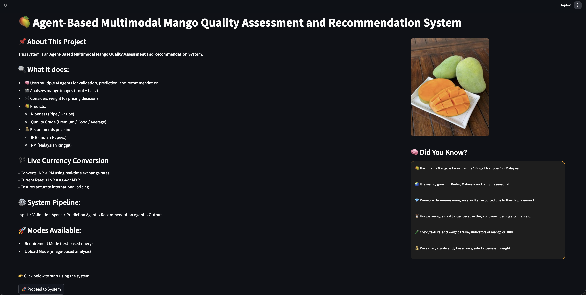
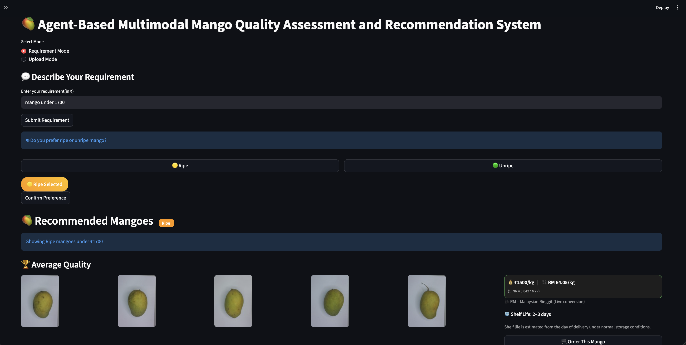
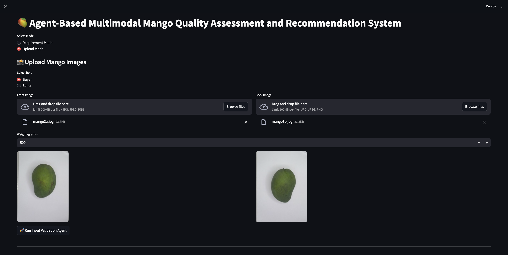
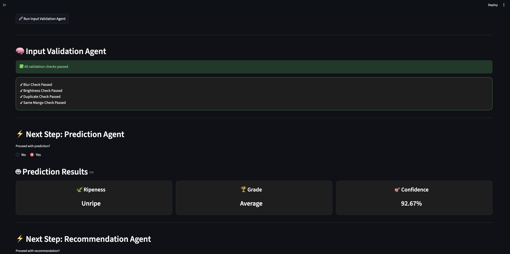
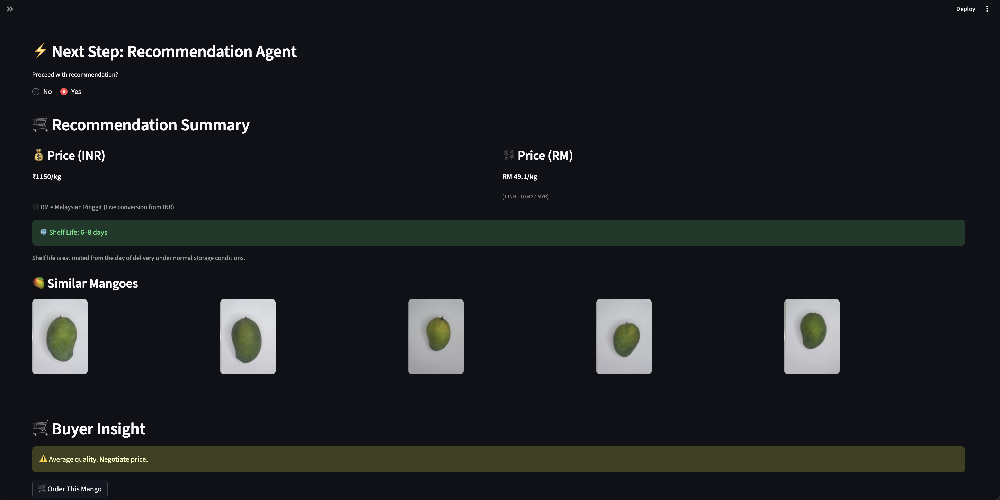

# 🥭 Agent-Based Multimodal Mango Quality Assessment and Recommendation System

An intelligent AI-powered system for **mango quality assessment, ripeness prediction, grade classification, price recommendation, and buyer decision support** using **computer vision, machine learning, multimodal learning, and agent-based workflow automation**.

---

## 🚀 Project Overview

This project uses **front-view image + back-view image + weight data** of Harumanis mangoes to automatically predict:

✅ Ripeness (Ripe / Unripe)  
✅ Quality Grade (Premium / Good / Average)  
✅ Confidence Score  
✅ Recommended Market Price (INR + RM)  
✅ Shelf Life Estimate  
✅ Similar Mango Suggestions  
✅ Buyer Insight Recommendation

The system is built with an **Agentic AI Pipeline**, where multiple intelligent agents validate inputs, predict quality, and generate recommendations.

---

## 🧠 Key Features

### 🔍 Input Validation Agent
Checks uploaded mango images for:

- Blur detection  
- Brightness validation  
- Duplicate image detection  
- Same mango verification (front + back)

### 🤖 Prediction Agent
Uses trained ML models for:

- Ripeness Classification  
- Grade Prediction  
- Confidence Estimation

### 💰 Recommendation Agent
Provides:

- Price in INR  
- Live RM Conversion  
- Shelf Life Estimate  
- Similar Mangoes  
- Buyer Negotiation Insight

### 🌐 Dual Mode System

#### 1️⃣ Requirement Mode
User enters budget and preference.

#### 2️⃣ Upload Mode
User uploads mango images + weight for AI analysis.

---

## 🏗️ Tech Stack

### Programming

- Python

### Libraries

- Streamlit  
- OpenCV  
- NumPy  
- Pandas  
- Scikit-learn  
- Matplotlib  
- skimage  
- joblib

### ML Models Used

- Gradient Boosting Classifier  
- Logistic Regression  
- SVM  
- Random Forest  
- Naive Bayes  
- Fusion Models

---

## 📊 Dataset

Custom Harumanis Mango Dataset containing:

- Front View Images  
- Back View Images  
- Weight Data  
- Ripeness Labels  
- Grade Labels

---

## ⚙️ Multimodal Learning Approach

The system combines:

- Visual Features from front image  
- Visual Features from back image  
- Mass / Weight Information

This improves prediction accuracy over single-input systems.

---

## 📈 Results

Achieved strong classification performance using multimodal fusion:

- High Ripeness Accuracy  
- Strong Grade Classification  
- Reliable Recommendation Output

Confusion matrices and evaluation results included in repository.

---

## 🖥️ User Interface

Built using **Streamlit Web App** with clean interactive workflow.

Features include:

- Image Upload UI  
- Live Predictions  
- Recommendation Dashboard  
- Validation Alerts

---

## 📂 Project Structure

```bash
Agent-Based-Multimodal-Mango-Quality-System/
│── app.py
│── model.py
│── pages/
│── images/
│── screenshots/
│── results/
│── *.pkl
│── datasets/
│── notebooks/
│── README.md
```

## 📸 Screenshots

### Home Page



### Requirement Mode



### Upload Mode



### Validation Agent



### Results


